# AppSettingUpdater PowerShell Module

[](https://github.com/PowerShell/PowerShell)
[](https://pester.dev/)
[](https://docs.microsoft.com/en-us/powershell/azure/)
[](#-testing)

## 🎯 Overview

**AppSettingUpdater v2.0** is an enterprise-grade PowerShell module for automated Azure Web App deployments with **zero-downtime slot swapping**. It provides safe, validated, and rollback-capable deployment automation for production environments.

### ✨ Key Features

- 🔄 **Safe Slot Swapping** - Swap with Preview → Validate → Complete or Rollback
- ⚙️ **Smart App Settings Management** - Only updates when values differ
- � **Parallel Processing** - Deploy to multiple web apps simultaneously with PowerShell Jobs
- �🔍 **Built-in Validation** - HTTP health checks with retry logic and URL templates
- 🛡️ **Automatic Rollback** - Emergency rollback on validation failure
- 📊 **Comprehensive Logging** - Structured output with timestamps and progress tracking
- 🧪 **Extensive Testing** - 25 unit tests with 100% function coverage
- 🚀 **CI/CD Ready** - Professional reporting and exit codes

## 📦 What's Included

```
AppSettingUpdater-Version2/
├── 📁 Module Core
│   ├── AppSettingUpdater.psd1          # Module manifest
│   └── AppSettingUpdater.psm1          # 6 production-ready functions
├── 🤖 Automation
│   ├── Run-AppSettingUpdate.ps1        # Enterprise deployment runbook
│   └── RUNBOOK-EXAMPLES.md             # Usage examples & scenarios
├── 🧪 Testing
│   ├── Run-Tests.ps1                   # Enhanced test runner
│   └── Tests/AppSettingUpdater.Tests.ps1 # 25 comprehensive tests
├── 📊 Reports
│   └── TestReport.xml                  # NUnit XML for CI/CD
└── 📖 Documentation
    └── README.md                       # This file
```

## ⚡ Quick Start

### 1️⃣ Prerequisites

```powershell
# Install required modules
Install-Module Az.Websites -Force -Scope CurrentUser
Install-Module Pester -MinimumVersion 5.0 -Force -Scope CurrentUser

# Connect to Azure
Connect-AzAccount
```

### 2️⃣ Import Module

```powershell
Import-Module ./AppSettingUpdater.psd1 -Force
```

### 3️⃣ Single Web App Deployment

```powershell
# Simple app setting update with slot swap
.\Run-AppSettingUpdate.ps1 -WebApp "MyApp" -ResourceGroup "MyRG" -SettingName "API_VERSION" -SettingValue "v2.0"
```

### 4️⃣ Multiple Web Apps (Parallel Processing)

```powershell
# Deploy to multiple web apps simultaneously
.\Run-AppSettingUpdate.ps1 -WebApp @("App1", "App2", "App3") -ResourceGroup "MyRG" -SettingName "VERSION" -SettingValue "2.0" -MaxParallelJobs 3
```

### 5️⃣ Production Deployment with Validation

```powershell
# Full production deployment with health checks
.\Run-AppSettingUpdate.ps1 `
    -WebApp "MyApp" `
    -ResourceGroup "MyRG" `
    -SettingName "FEATURE_FLAG" `
    -SettingValue "enabled" `
    -ValidationUrl "https://myapp.azurewebsites.net/health" `
    -ValidationTimeoutSeconds 600
```

## 🔧 Module Functions

| Function | Purpose | Key Features |
|----------|---------|--------------|
| `Test-WebAppContext` | Validate Azure prerequisites | ✅ Module & authentication checks |
| `Get-WebAppSlotTarget` | Discover deployment targets | ✅ Multi-app support, error handling |
| `Set-WebAppSlotAppSetting` | Update app settings intelligently | ✅ Idempotent, dry-run mode |
| `Start-WebAppSlotSwapPreview` | Initiate slot swap preview | ✅ Configurable slots, validation ready |
| `Complete-WebAppSlotSwap` | Complete validated deployments | ✅ Production promotion |
| `Undo-WebAppSlotSwap` | Emergency rollback | ✅ Instant recovery |

## 🚀 Advanced Usage Examples

### Enterprise Parallel Deployment
```powershell
# Deploy to multiple apps with custom validation and job control
.\Run-AppSettingUpdate.ps1 `
    -WebApp @("ProdApp1", "ProdApp2", "ProdApp3", "ProdApp4") `
    -ResourceGroup "Production" `
    -SettingName "RELEASE_VERSION" `
    -SettingValue "2024.12.1" `
    -ValidationUrl "https://{WebApp}.company.com/health" `
    -MaxParallelJobs 3 `
    -JobTimeoutMinutes 45 `
    -Force
```

### Enterprise CI/CD Pipeline
```powershell
# Automated deployment with no prompts (CI/CD)
.\Run-AppSettingUpdate.ps1 `
    -WebApp "ProdApp" `
    -ResourceGroup "Production" `
    -SettingName "BUILD_NUMBER" `
    -SettingValue $env:BUILD_ID `
    -ValidationUrl "https://prodapp.com/api/health" `
    -Force  # Skip confirmation prompts
```

### Development Testing
```powershell
# Safe testing with dry run
.\Run-AppSettingUpdate.ps1 `
    -WebApp "DevApp" `
    -ResourceGroup "Development" `
    -Slot "qa" `
    -SettingName "DEBUG_MODE" `
    -SettingValue "true" `
    -DryRun
```

### Manual Function Usage
```powershell
# Direct function calls for custom workflows
Import-Module ./AppSettingUpdater.psd1

# Check prerequisites
Test-WebAppContext

# Update setting only (no swap)
$result = Set-WebAppSlotAppSetting -WebApp "MyApp" -Slot "staging" -ResourceGroup "MyRG" -SettingName "API_KEY" -SettingValue "secret123"

# Manual swap control
Start-WebAppSlotSwapPreview -WebApp "MyApp" -ResourceGroup "MyRG"
# ... perform custom validation ...
Complete-WebAppSlotSwap -WebApp "MyApp" -ResourceGroup "MyRG"
```

## 🧪 Testing

### Run Complete Test Suite
```powershell
# Execute all 25 tests with enhanced reporting
.\Run-Tests.ps1
```

**Test Coverage:**
- ✅ **25 tests** covering all functions
- ✅ **Happy path scenarios** - Normal operations
- ✅ **Error conditions** - Azure failures, invalid parameters
- ✅ **Edge cases** - Empty collections, special characters
- ✅ **Parameter validation** - ValidateSet, ValidateNotNullOrEmpty
- ✅ **Integration scenarios** - Complex real-world cases

### Sample Test Output
```
=== Test Execution Summary ===
Duration: 0.67 seconds
Tests Run: 25
Passed: 25 ✓
Failed: 0
Success Rate: 100%
🎉 ALL TESTS PASSED!
```

## 🔄 Deployment Workflow

The automated runbook follows enterprise deployment best practices:

```mermaid
graph TD
    A[Start Deployment] --> B[Validate Azure Context]
    B --> C[Validate Target Slot]
    C --> D[Update App Settings]
    D --> E[User Confirmation]
    E --> F[Initiate Swap Preview]
    F --> G[HTTP Validation Checks]
    G --> H{Validation Passed?}
    H -->|Yes| I[Complete Swap]
    H -->|No| J[Rollback Swap]
    I --> K[✅ Success]
    J --> L[⚠️ Rolled Back]
```



## 💻 Development & Contribution

### Project Standards
- **PowerShell Style**: Follow [PowerShell Practice and Style](https://poshcode.gitbook.io/powershell-practice-and-style/)
- **Testing**: Pester 5.x with minimum 90% coverage
- **Documentation**: Comment-based help for all functions
- **Error Handling**: Structured error messages with context

### Local Development Setup
```powershell
# Clone repository
git clone https://github.com/yourusername/AppSettingUpdater.git
cd AppSettingUpdater

# Install dependencies
Install-Module Az.Websites, Pester -Force

# Run tests
.\Run-Tests.ps1

# Import for testing
Import-Module .\AppSettingUpdater.psd1 -Force
```

### Pull Request Guidelines
1. **Add tests** for new functionality
2. **Update documentation** including README and function help
3. **Ensure all tests pass** (`.\Run-Tests.ps1`)
4. **Follow PowerShell best practices**

## 🔧 Configuration

### Supported Azure Slots
- `staging` (default)
- `testing`
- `qa` 
- `preprod`

### Environment Variables
```powershell
# Optional: Set default values
$env:APPSETTING_DEFAULT_TIMEOUT = "300"  # Validation timeout
$env:APPSETTING_DEFAULT_SLOT = "staging"  # Default source slot
```

## 📋 Requirements

| Component | Version | Purpose |
|-----------|---------|---------|
| **PowerShell** | 5.1+ or 7.x | Runtime environment |
| **Az.Websites** | Latest | Azure Web App management |
| **Pester** | 5.0+ | Testing framework |
| **Azure Account** | Active subscription | Cloud resources |

### Installation Commands
```powershell
# One-time setup
Install-Module Az.Websites -Force -Scope CurrentUser
Install-Module Pester -MinimumVersion 5.0 -Force -Scope CurrentUser
Connect-AzAccount
```

## 🚨 Troubleshooting

### Common Issues

**Authentication Errors**
```powershell
# Solution: Re-authenticate
Connect-AzAccount
```

**Pester Version Conflicts**
```powershell
# Solution: Install correct version
Uninstall-Module Pester -AllVersions
Install-Module Pester -MinimumVersion 5.0 -Force
```

**Module Import Failures**
```powershell
# Solution: Use absolute path
Import-Module "C:\Full\Path\To\AppSettingUpdater.psd1" -Force
```

## 📄 License

MIT License - see [LICENSE](LICENSE) file for details.

## 🏷️ Version History

- **v2.0.0** - Complete rewrite with enterprise features
  - Enhanced deployment runbook with validation
  - Comprehensive test suite (25 tests)
  - Modern Pester 5.x compatibility
  - Professional reporting and logging
  - Automatic rollback capabilities

- **v1.0.0** - Initial release
  - Basic app setting updates
  - Simple slot swapping

## 🤝 Support & Community

- **Issues**: [GitHub Issues](https://github.com/yourusername/AppSettingUpdater/issues)
- **Discussions**: [GitHub Discussions](https://github.com/yourusername/AppSettingUpdater/discussions)
- **Documentation**: See [RUNBOOK-EXAMPLES.md](RUNBOOK-EXAMPLES.md) for detailed scenarios

---

<div align="center">

**Made with ❤️ for Azure DevOps automation**

*Star ⭐ this repo if it helped you!*

</div>
