# AppSettingUpdater PowerShell Module

[](https://github.com/PowerShell/PowerShell)
[](https://pester.dev/)
[](https://docs.microsoft.com/en-us/powershell/azure/)
[](#-testing)

## 🎯 Overview

**AppSettingUpdater v3.0** is a PowerShell module for automated Azure Web App deployments with **slot-based deployment patterns**. It provides a **template-based approach** to safely update app settings and deploy to production through **non-production slots with validation checkpoints**.

### ✨ Key Features

- 🔄 **Slot-Based Deployments** - Update settings in non-production slots, then swap to production
- ⚙️ **Smart App Settings Management** - Only updates when values actually differ
- 🚀 **Parallel Processing** - Deploy to multiple web apps simultaneously with PowerShell Jobs
- 🎨 **Template-Based Automation** - Customizable `SampleAutomationRunbook.ps1` with slot deployment workflow
- 🔍 **Validation Checkpoints** - Built-in validation steps with rollback capability
- 📊 **Comprehensive Logging** - Structured output with timestamps and progress tracking
- 🧪 **Extensive Testing** - 25 unit tests with 100% function coverage
- 🚀 **CI/CD Ready** - Professional reporting and exit codes
- 🛠️ **Easy Customization** - Clear template structure for adding business logic

## 📦 What's Included

```
AppSettingUpdater-Version3/
├── 📁 Module Core
│   ├── AppSettingUpdater.psd1          # Module manifest
│   └── AppSettingUpdater.psm1          # 6 production-ready functions
├── 🤖 Automation
│   └── SampleAutomationRunbook.ps1     # Customizable automation template
├── 🧪 Testing
│   ├── Run-Tests.ps1                   # Enhanced test runner
│   └── Tests/AppSettingUpdater.Tests.ps1 # 25 comprehensive tests
├── 📊 Reports
│   └── TestReport.xml                  # NUnit XML for CI/CD
└── 📖 Documentation
    └── README.md                       # This file
```

## 🎨 Template-Based Approach

**v3.0** introduces a slot-based deployment template approach:

- **`SampleAutomationRunbook.ps1`** - A comprehensive template for safe Azure Web App deployments
- **Slot-Based Workflow** - Update settings in non-production slots first, then swap to production
- **Validation Checkpoints** - Built-in validation steps with rollback capability  
- **Parallel Execution** - Built-in support for multiple web apps
- **Easy Customization** - Clear structure for adding your own business logic and validation
- **Production-Safe** - Follows enterprise deployment best practices

**Deployment Workflow:**
1. Update app settings in non-production slot (staging/qa/testing)
2. Initiate slot swap with preview
3. Validation checkpoint (customizable)
4. Complete slot swap to production
5. Post-deployment verification

The template serves as your starting point - copy it, modify it, and adapt it to your specific Azure environment and requirements.

### 🔄 Slot-Based Deployment Benefits

- **Zero-Downtime Deployments** - Settings are updated in non-production slots first
- **Built-in Rollback** - Automatic rollback if validation fails
- **Safe Testing** - Validate changes before they reach production
- **Enterprise-Ready** - Follows Azure Web App deployment best practices
- **Customizable Validation** - Add your own health checks and business validation
- **Parallel Support** - Deploy to multiple apps simultaneously with consistent patterns

## ⚡ Quick Start

### 1️⃣ Prerequisites

```powershell
# Set execution policy to allow running scripts (if not already set)
Set-ExecutionPolicy -ExecutionPolicy RemoteSigned -Scope CurrentUser

# Install required modules
Install-Module Az.Websites -Force -Scope CurrentUser
Install-Module Pester -MinimumVersion 5.0 -Force -Scope CurrentUser

# Connect to Azure
Connect-AzAccount
```

### 2️⃣ Import Module

```powershell
Import-Module ./AppSettingUpdater.psd1 -Force
```

### 3️⃣ Slot-Based Deployment

```powershell
# Safe slot-based deployment with settings update
.\SampleAutomationRunbook.ps1 -WebApps "MyApp" -ResourceGroup "MyRG" -SettingName "API_VERSION" -SettingValue "v2.0"
```

### 4️⃣ Multiple Web Apps (Parallel Deployments)

```powershell
# Deploy to multiple web apps simultaneously with slot-based pattern
.\SampleAutomationRunbook.ps1 -WebApps @("App1", "App2", "App3") -ResourceGroup "MyRG" -SettingName "VERSION" -SettingValue "2.0" -MaxParallelJobs 3
```

### 5️⃣ Custom Non-Production Slot

```powershell
# Use custom non-production slot before production deployment
.\SampleAutomationRunbook.ps1 `
    -WebApps "MyApp" `
    -ResourceGroup "MyRG" `
    -SettingName "FEATURE_FLAG" `
    -SettingValue "enabled" `
    -Slot "qa"
```

## 🔧 Module Functions

| Function | Purpose | Key Features |
|----------|---------|--------------|
| `Test-WebAppContext` | Validate Azure prerequisites | ✅ Module & authentication checks |
| `Get-WebAppSlotTarget` | Discover deployment targets | ✅ Multi-app support, error handling |
| `Set-WebAppSlotAppSetting` | Update app settings intelligently | ✅ Idempotent, dry-run mode |
| `Start-WebAppSlotSwapPreview` | Initiate slot swap preview | ✅ Configurable slots, validation ready |
| `Complete-WebAppSlotSwap` | Complete validated deployments | ✅ Production promotion |
| `Undo-WebAppSlotSwap` | Emergency rollback | ✅ Instant recovery |

## 🚀 Advanced Usage Examples

### Enterprise Parallel Deployment
```powershell
# Deploy to multiple apps with slot-based pattern and parallel job control
.\SampleAutomationRunbook.ps1 `
    -WebApps @("ProdApp1", "ProdApp2", "ProdApp3", "ProdApp4") `
    -ResourceGroup "Production" `
    -SettingName "RELEASE_VERSION" `
    -SettingValue "2024.12.1" `
    -MaxParallelJobs 3 `
    -Force
```

### Enterprise CI/CD Pipeline
```powershell
# Automated slot-based deployment with no prompts (CI/CD)
.\SampleAutomationRunbook.ps1 `
    -WebApps "ProdApp" `
    -ResourceGroup "Production" `
    -SettingName "BUILD_NUMBER" `
    -SettingValue $env:BUILD_ID `
    -Force  # Skip confirmation prompts
```

### Development Testing
```powershell
# Safe testing with dry run - simulates full slot-based workflow
.\SampleAutomationRunbook.ps1 `
    -WebApps "DevApp" `
    -ResourceGroup "Development" `
    -Slot "qa" `
    -SettingName "DEBUG_MODE" `
    -SettingValue "true" `
    -DryRun
```

### Manual Function Usage
```powershell
# Direct function calls for custom workflows
Import-Module ./AppSettingUpdater.psd1

# Check prerequisites
Test-WebAppContext

# Update setting only (no swap)
$result = Set-WebAppSlotAppSetting -WebApp "MyApp" -Slot "staging" -ResourceGroup "MyRG" -SettingName "API_KEY" -SettingValue "secret123"

# Manual swap control
Start-WebAppSlotSwapPreview -WebApp "MyApp" -ResourceGroup "MyRG"
# ... perform custom validation ...
Complete-WebAppSlotSwap -WebApp "MyApp" -ResourceGroup "MyRG"
```

### Automation Template Usage
```powershell
# Use the slot-based deployment template as a starting point
# Customize SampleAutomationRunbook.ps1 for your specific needs:
# 1. Copy the template to your own script
# 2. Modify validation logic and deployment steps
# 3. Add custom health checks and business logic
# 4. Integrate with your CI/CD pipeline

.\SampleAutomationRunbook.ps1 `
    -WebApps @("App1", "App2") `
    -ResourceGroup "MyRG" `
    -SettingName "CONFIG_VERSION" `
    -SettingValue "1.2.3" `
    -Slot "staging" `
    -DryRun  # Test the full workflow first

# The template demonstrates:
# Phase 1: Update settings in non-production slot
# Phase 2: Initiate slot swap with preview
# Phase 3: Validation checkpoint (customizable)
# Phase 4: Complete slot swap to production
# Phase 5: Post-deployment verification
```

## 🧪 Testing

### Run Complete Test Suite
```powershell
# Execute all 25 tests with enhanced reporting
.\Run-Tests.ps1
```

**Test Coverage:**
- ✅ **25 tests** covering all functions
- ✅ **Happy path scenarios** - Normal operations
- ✅ **Error conditions** - Azure failures, invalid parameters
- ✅ **Edge cases** - Empty collections, special characters
- ✅ **Parameter validation** - ValidateSet, ValidateNotNullOrEmpty
- ✅ **Integration scenarios** - Complex real-world cases

### Sample Test Output
```
=== Test Execution Summary ===
Duration: 0.67 seconds
Tests Run: 25
Passed: 25 ✓
Failed: 0
Success Rate: 100%
🎉 ALL TESTS PASSED!
```

## 🔄 Deployment Workflow

The slot-based deployment template follows enterprise deployment best practices:

```mermaid
graph TD
    A[Start Deployment] --> B[Validate Azure Context]
    B --> C[Validate Non-Production Slot]
    C --> D[Update App Settings in Slot]
    D --> E[Initiate Slot Swap Preview]
    E --> F[Validation Checkpoint]
    F --> G{Validation Passed?}
    G -->|Yes| H[Complete Slot Swap]
    G -->|No| I[Rollback Swap]
    H --> J[Post-Deployment Verification]
    J --> K[✅ Success]
    I --> L[⚠️ Rolled Back]
```



## 💻 Development & Contribution

### Project Standards
- **PowerShell Style**: Follow [PowerShell Practice and Style](https://poshcode.gitbook.io/powershell-practice-and-style/)
- **Testing**: Pester 5.x with minimum 90% coverage
- **Documentation**: Comment-based help for all functions
- **Error Handling**: Structured error messages with context

### Local Development Setup
```powershell
# Clone repository
git clone https://github.com/yourusername/AppSettingUpdater.git
cd AppSettingUpdater

# Install dependencies
Install-Module Az.Websites, Pester -Force

# Run tests
.\Run-Tests.ps1

# Import for testing
Import-Module .\AppSettingUpdater.psd1 -Force
```

### Pull Request Guidelines
1. **Add tests** for new functionality
2. **Update documentation** including README and function help
3. **Ensure all tests pass** (`.\Run-Tests.ps1`)
4. **Follow PowerShell best practices**

## 🔧 Configuration

### Supported Azure Slots
- `staging` (default for non-production)
- `testing`
- `qa` 
- `preprod`

*Note: The template updates settings in the specified non-production slot, then swaps to production.*

### Environment Variables
```powershell
# Optional: Set default values
$env:APPSETTING_DEFAULT_SLOT = "staging"  # Default non-production slot
$env:APPSETTING_MAX_PARALLEL = "5"       # Default parallel jobs
```

## 📋 Requirements

| Component | Version | Purpose |
|-----------|---------|---------|
| **PowerShell** | 5.1+ or 7.x | Runtime environment |
| **Az.Websites** | Latest | Azure Web App management |
| **Pester** | 5.0+ | Testing framework |
| **Azure Account** | Active subscription | Cloud resources |

### Installation Commands
```powershell
# One-time setup
Set-ExecutionPolicy -ExecutionPolicy RemoteSigned -Scope CurrentUser  # Allow script execution
Install-Module Az.Websites -Force -Scope CurrentUser
Install-Module Pester -MinimumVersion 5.0 -Force -Scope CurrentUser
Connect-AzAccount
```

## 🚨 Troubleshooting

### Common Issues

**Execution Policy Errors**
```powershell
# If you get "execution of scripts is disabled on this system"
Set-ExecutionPolicy -ExecutionPolicy RemoteSigned -Scope CurrentUser

# Alternative: Bypass execution policy for a single session
PowerShell -ExecutionPolicy Bypass -File ".\SampleAutomationRunbook.ps1" -WebApps "MyApp" -ResourceGroup "MyRG" -SettingName "TEST" -SettingValue "value"
```

**Authentication Errors**
```powershell
# Solution: Re-authenticate
Connect-AzAccount
```

**Pester Version Conflicts**
```powershell
# Solution: Install correct version
Uninstall-Module Pester -AllVersions
Install-Module Pester -MinimumVersion 5.0 -Force
```

**Module Import Failures**
```powershell
# Solution: Use absolute path
Import-Module "C:\Full\Path\To\AppSettingUpdater.psd1" -Force
```
